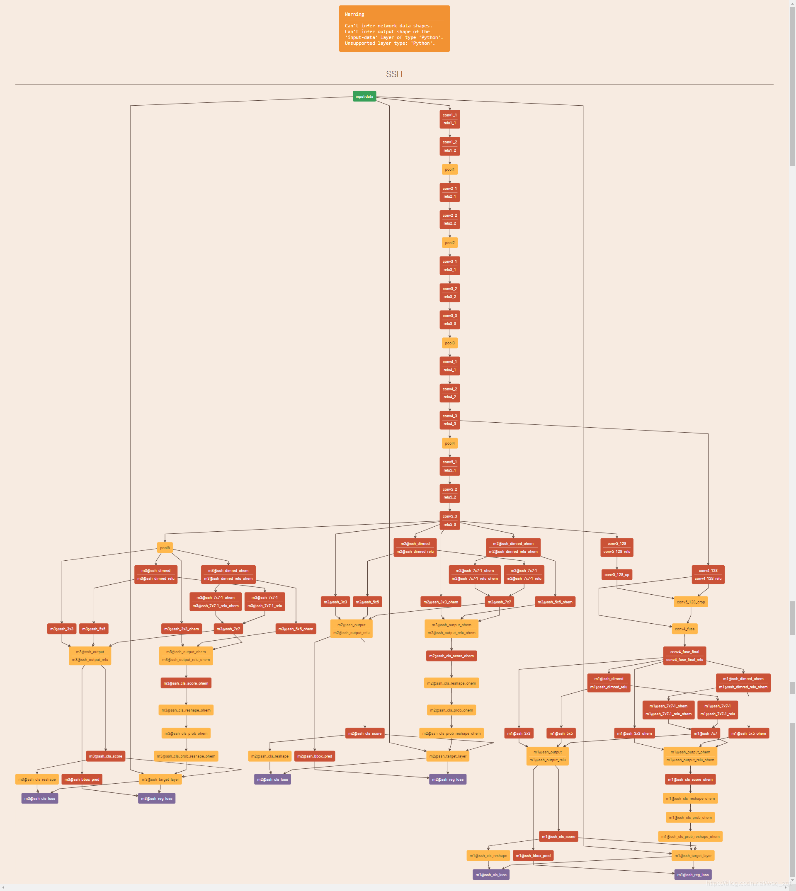

SSH: Single Stage Headless Face Detector
<!-- /TOC -->

# SSH描述

论文题目《SSH：Single Stage Headless Face Detector》

作者 Mahyar Narjibi 与 Pouya Samangouei 2017

文章：https://arxiv.org/abs/1708.03979

代码地址：https://github.com/mahyarnajibi/SSH

SSH为single stage headless的缩写，为单阶段检测器。
所谓的headless指的就是只保留基础网络，将原始分类网络中的全连接层去掉的意思，比如VGG16中的全连接层。
这样做可以去掉大量的参数，同时加速运算，毕竟卷积的运算量和参数量相比全连接来说少了太多。
作者对卷积层使用了3种类型的检测模块，利用不同的卷积步长来同时检测大、中、小三种人脸。
相比较基于RPN的网络，SSH不再是先用RPN生成anchor，然后进行分类和回归，而是直接进行分类和回归。
在速度上会有5倍以上的提升，如果同时采用图像金字塔的话，会在精度上有进一步的提升，但是会导致网络前向变慢。

# 模型架构
参考下图网络间隔与论文中具体模块设计

同时基于利用[ModelZoo](https://gitee.com/mindspore/models)中的[Faster R-CNN框架](https://gitee.com/mindspore/models/tree/master/research/cv/faster_rcnn_dcn) 进行数据预处理、标定等操作


# 数据集

使用的数据集：[WIDER FACE: A Face Detection Benchmark](<http://shuoyang1213.me/WIDERFACE/>)

- 数据集大小：32,203 images and label 393,703 faces
    - 训练集：40%
    - 验证集：10%
    - 测试集：50%

# 环境要求

- 本地

    - 见pip_list.txt

# 训练

1. 下载数据集，按照default_config.yaml中设置路径
```yaml
mindrecord_dir: './dataset/mindrecord/'
image_dir: './dataset/WIDER_train/images/'
anno_path: './dataset/WIDER_annotation/wider_face_train_bbx_gt.txt'
```

2. 开始训练:

```shell
python SSH_train.py
```
每个epcho结果会输出到loss_*.log文件中（文件输出的mode是"add"，可能会多个训练过程混杂在一起）

# 测试

1. 将test文件夹下的测试文件进行人脸检测，检测结果也会保存在改文件夹，部分测试结果可见test文件夹：

```shell
python SSH_test.py
```

2. 一张图像测试结果如下。


   

